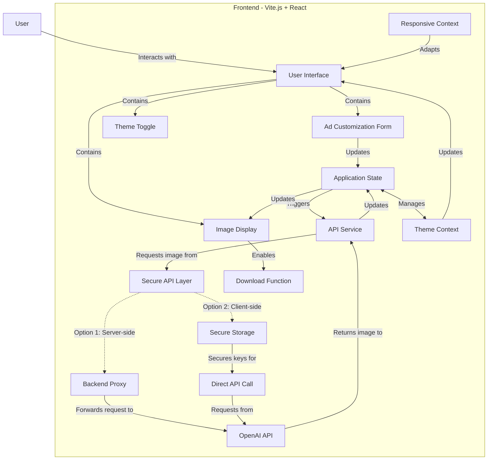
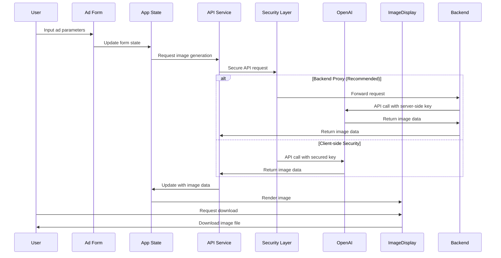
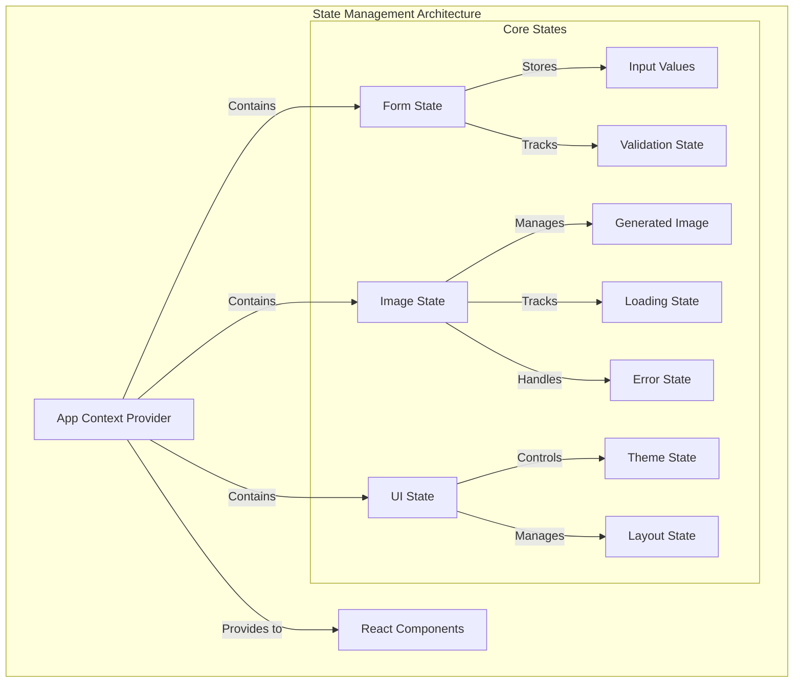
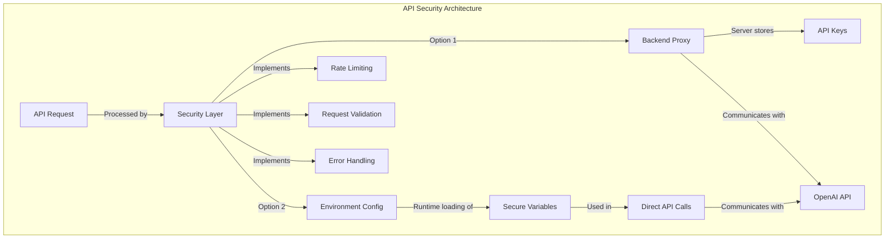
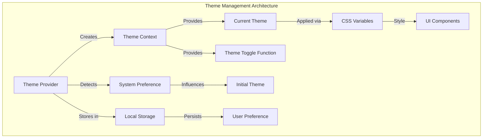
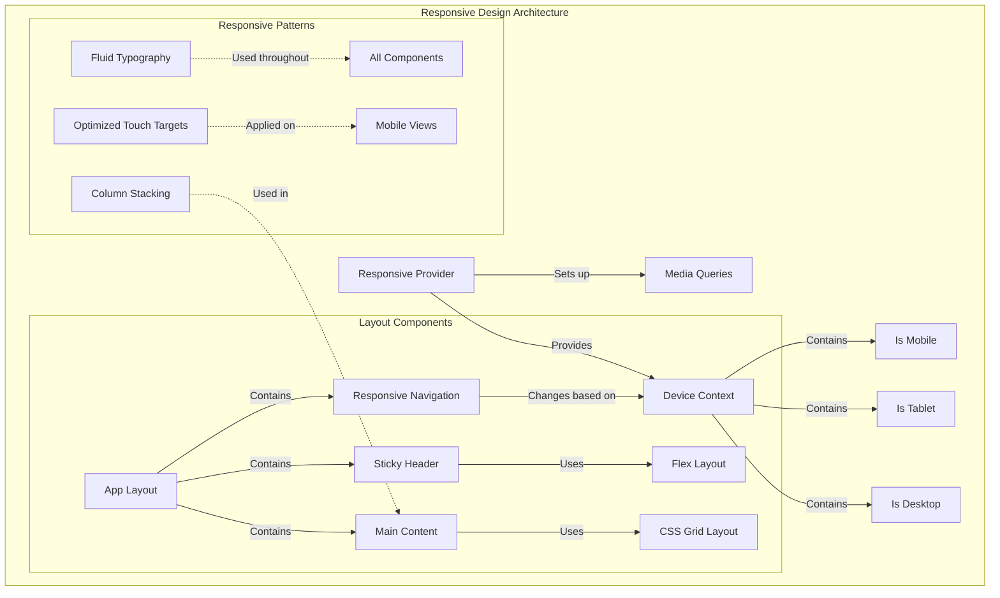
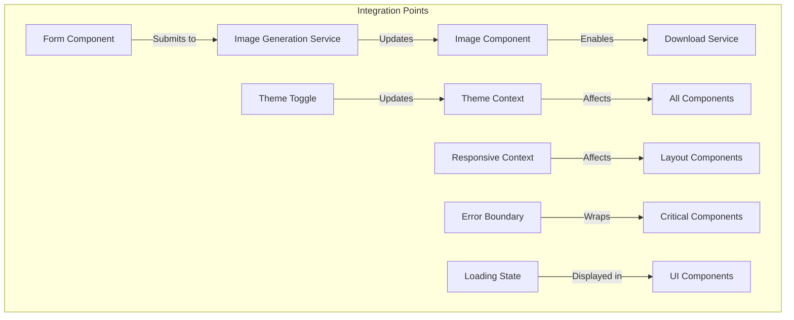

# Advertisement Generator Architecture

## 1. System Architecture Overview



The advertisement generator is a Single Page Application built with Vite.js and React, featuring OpenAI image API integration, ad customization form, image display with download functionality, secure API handling, and responsive design with dark mode support.

## 2. Data Flow for Image Generation Process



This flow shows the complete process from user input to image download, highlighting the security considerations in API communication.

## 3. State Management Strategy



### Implementation Details

The app will use React's Context API with custom hooks for efficient state management:

```javascript
// State structure (pseudo-code)
const initialState = {
  form: {
    inputs: { prompt: '', style: 'modern', size: 'medium' },
    isValid: false,
    isDirty: false
  },
  image: {
    data: null,
    isLoading: false,
    error: null,
    history: []
  },
  ui: {
    theme: 'light',
    isMobileMenuOpen: false,
    currentView: 'form'
  }
};
```

Custom hooks will provide encapsulated state management functionality:

- `useFormState()` - Form data management and validation
- `useImageState()` - Image generation, storage, and download
- `useUIState()` - Theme toggling and responsive UI adjustments

## 4. API Integration Approach with Security Considerations



### Security Implementation Recommendations

1. **Backend Proxy Approach (Recommended)**
   - Create a lightweight server (Express/Node.js, Vercel Serverless, etc.)
   - Store API keys as server environment variables
   - Implement rate limiting and request validation
   - Forward sanitized requests to OpenAI API

2. **Client-side Security (Alternative)**
   - Use environment variables with Vite's env handling
   - Load values at runtime instead of build time
   - Implement usage quotas and monitoring
   - Consider using services like Auth0 for additional security

### API Service Structure

```javascript
// Pseudocode for API service
class ImageGenerationService {
  constructor(config) {
    this.baseUrl = config.baseUrl;
    this.securityProvider = config.securityProvider;
  }
  
  async generateImage(params) {
    try {
      const secureParams = this.securityProvider.secureRequest(params);
      const response = await fetch(`${this.baseUrl}/generate`, {
        method: 'POST',
        headers: this.securityProvider.getHeaders(),
        body: JSON.stringify(secureParams)
      });
      
      return this.handleResponse(response);
    } catch (error) {
      this.handleError(error);
    }
  }
}
```

## 5. Theme Management Architecture



### CSS Variable Implementation

```css
:root {
  /* Base colors - shared across themes */
  --primary: #3a86ff;
  --secondary: #ff006e;
  --success: #8ac926;
  --warning: #ffbe0b;
  --error: #ff5a5f;
  
  /* Light theme (default) */
  --background: #ffffff;
  --surface: #f5f5f5;
  --text-primary: #333333;
  --text-secondary: #666666;
  --border: #dddddd;
}

[data-theme='dark'] {
  --background: #121212;
  --surface: #222222;
  --text-primary: #ffffff;
  --text-secondary: #aaaaaa;
  --border: #444444;
  
  /* Optional adjustments to base colors for dark mode */
  --primary: #60a5fa;
  --warning: #ffd166;
}
```

### Theme Provider Implementation

```jsx
// Pseudocode for ThemeProvider
function ThemeProvider({ children }) {
  // Check user preference or system preference
  const [theme, setTheme] = useState(() => {
    const saved = localStorage.getItem('theme');
    const prefersDark = window.matchMedia('(prefers-color-scheme: dark)').matches;
    return saved || (prefersDark ? 'dark' : 'light');
  });
  
  // Update document attribute when theme changes
  useEffect(() => {
    document.documentElement.setAttribute('data-theme', theme);
    localStorage.setItem('theme', theme);
  }, [theme]);
  
  // Toggle function
  const toggleTheme = () => {
    setTheme(current => current === 'light' ? 'dark' : 'light');
  };
  
  return (
    <ThemeContext.Provider value={{ theme, toggleTheme }}>
      {children}
    </ThemeContext.Provider>
  );
}
```

## 6. Responsive Design Architecture



### Breakpoint Strategy

```javascript
// Mobile-first breakpoint system
const breakpoints = {
  xs: '0px',      // Base mobile
  sm: '576px',    // Large mobile
  md: '768px',    // Tablets
  lg: '992px',    // Desktops
  xl: '1200px'    // Large desktops
};

// Usage with CSS-in-JS or SCSS
const mediaQueries = {
  sm: `@media (min-width: ${breakpoints.sm})`,
  md: `@media (min-width: ${breakpoints.md})`,
  lg: `@media (min-width: ${breakpoints.lg})`,
  xl: `@media (min-width: ${breakpoints.xl})`
};
```

### Responsive Layout Structure

The app will use a CSS Grid and Flexbox combination for optimal layout control:

```css
/* Main layout grid */
.app-layout {
  display: grid;
  grid-template-areas:
    "header"
    "main"
    "footer";
  grid-template-rows: auto 1fr auto;
  min-height: 100vh;
}

@media (min-width: 768px) {
  .app-layout {
    grid-template-areas:
      "header header"
      "nav main"
      "footer footer";
    grid-template-columns: 250px 1fr;
  }
}

/* Sticky header implementation */
.header {
  grid-area: header;
  position: sticky;
  top: 0;
  z-index: 100;
  display: flex;
  justify-content: space-between;
  align-items: center;
  padding: 1rem;
  background-color: var(--surface);
  box-shadow: 0 2px 4px rgba(0,0,0,0.1);
}

/* Responsive main content */
.main-content {
  grid-area: main;
  display: grid;
  grid-template-columns: 1fr;
  gap: 1.5rem;
  padding: 1.5rem;
}

@media (min-width: 992px) {
  .main-content {
    grid-template-columns: 1fr 1fr;
  }
}
```

## 7. Integration Points and Component Relationships



Each component will have clear responsibilities and integration points with other components, ensuring modular and maintainable code.

## 8. Conclusion

This architecture provides a comprehensive blueprint for implementing the advertisement generator application with Vite.js and React. The design emphasizes:

- Secure API integration with OpenAI
- Clear separation of concerns with modular components
- Efficient state management with React Context and custom hooks
- Flexible theme management with dark mode support
- Responsive design for all device types
- Clean data flow patterns for image generation and download

By following this architecture, the implementation will be maintainable, scalable, and aligned with modern web development best practices.